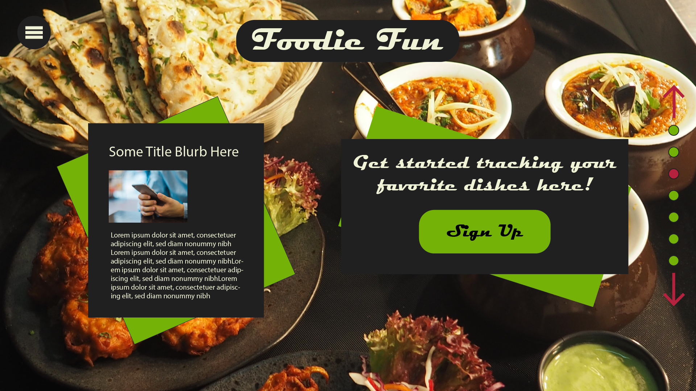

# Tim's landing page for Foodie Fun

## Mockup

I threw this together in Illustrator to play around with some ideas, and decide (roughly) what I want to build.  I'll probably end up with something a bit different (I'm really not satisfied with how the CTA component looks here), but this is an approximation of the layout I'd like to create, and colors I will use.  The fonts will be changing.

The basic idea is a carousel with about 4-6 slides, each with a fullscreen image of food and a card with some copy about the app.

